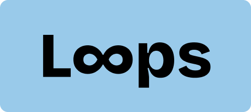
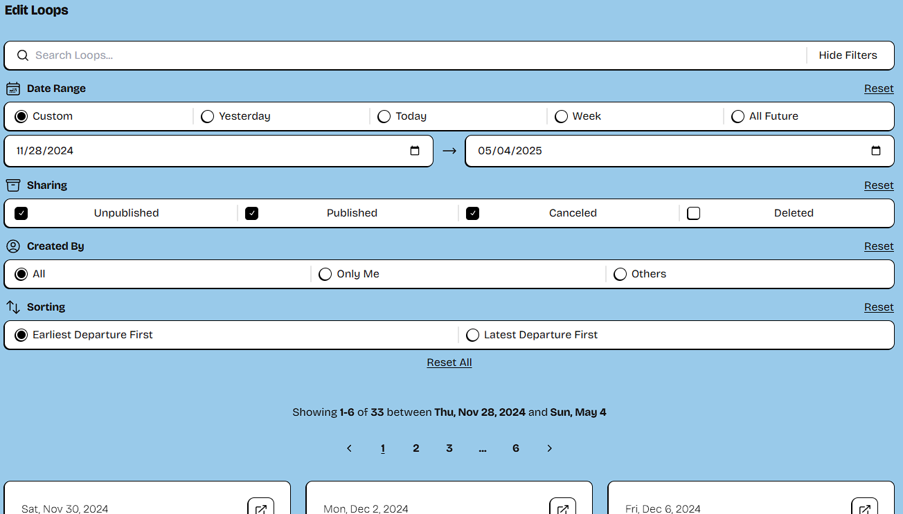
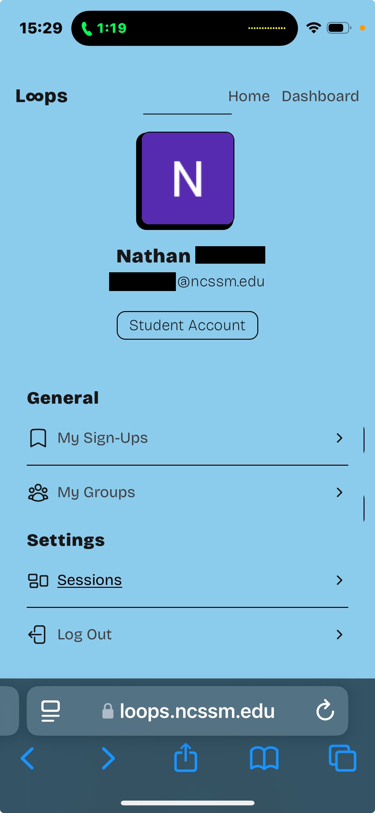
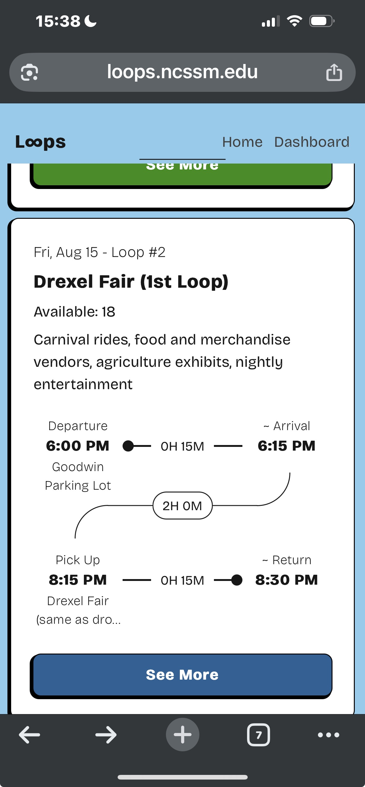
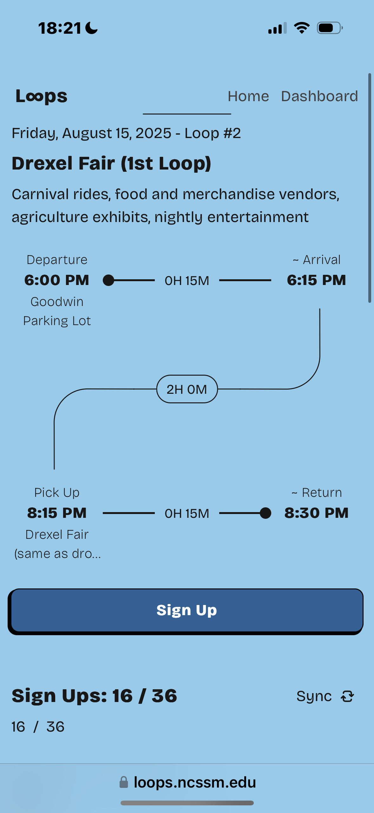
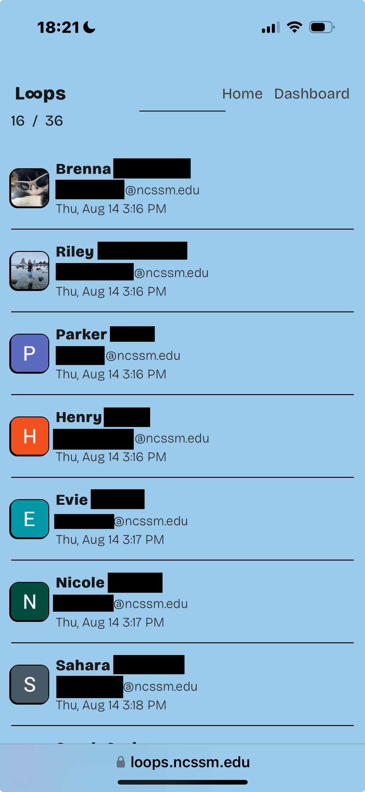
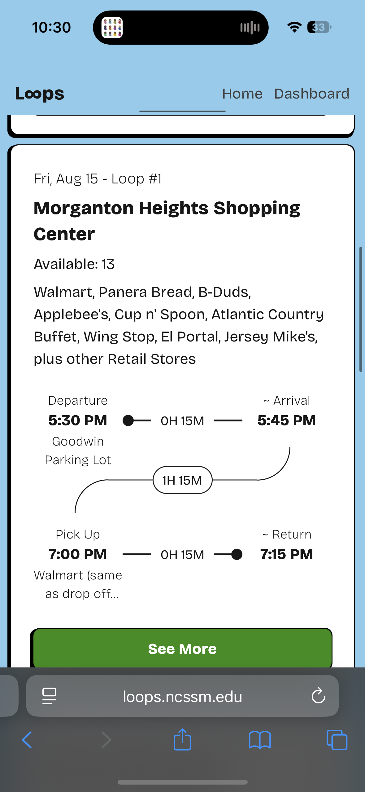
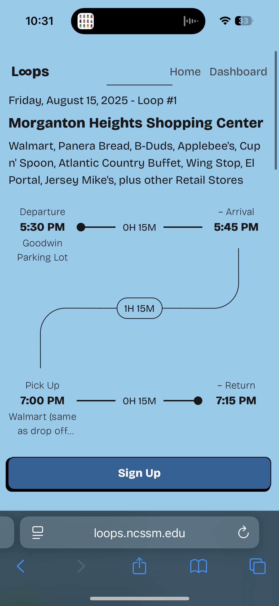

<div align="center">



#### Created by Aryan Gera '25 (gera25aryan@ncssm.edu)
Loops provide students with easy access to essential shopping, dining, and recreational activities during their time on campus. 

This web application (L∞ps) provides student life a way to conviently publish and keep track of loops and allows students to securely sign up for these loops.

L∞ps replaces the old, clunky spreadsheet system and is in production on [https://loops.ncssm.edu](https://loops.ncssm.edu).

> *Requires @ncssm.edu email AND a connection to either NCSSM's eduroam wifi or NCSSM's VPN*

</div>


## Demo

### Authentication Flow

When a user first visits the site, they see a login page. 


After logging in with their NCSSM Google Account, they see their dashboard. 


- By default, their account will have `No Access` (Level 0 Perms). 

- If an administrator had previously registered their email, then they would have either `Student Access` (Level 1) or `Loops Access` (Level 2).

- If the ITS department had previously registered their email, then they would have `Admin Access` (Level 3).

### Admin Access

Admins can register emails, manage access, and manage accounts in the `Manage Accounts` Page and the Manage `Loops Access` Page.


### Loops Access

Accounts with `Loops Access` (Level 2 Perms) have two main responsibilities:
- Managing Student Groups 
- Managing Loops

#### Managing Student Groups
The main purpose of Student Groups is for reservations. As the name suggests, these are for grouping students together.

Some examples of what groups could be used for:
- Residence Hall
- Sports Club
- Mentorship/SRIP groups

Groups can also have subgroups. For example, you might create `South Halls` with `1st South`, `2nd South`, `3rd South`, and `4th South` as subgroups. 
> All groups are part of a Directed Acyclic Graph (DAG). 


All groups can be editted as well.


#### Managing Loops
This page is for creating and managing loops. It provides QOL features such as autofilling information based on title, duplication, search, and more.


Below, options for editting, deleting/restoring, canceling/uncanceling, publishing/unpublishing loops are provided. 


Editting a loop not only provides the ability to edit the loop's content, but it also provides the ability to edit sign-ups. Loops Access can easily filter through and add/remove sign-ups.


### Student Access

Students have the ability to easily filter for loops, sign-up with the click of a button, and find all of their sign-ups in one place.

#### Filtering


#### Signing-up


#### My Sign-ups Page


<!-- 
<div align="center">
<i>Search Filters for Editting Loops (/dashboard/manage-loops)<i/>
<br/>
<br/>
</div>


<div align="center">
<i>Search Filters for Editting Loops (/dashboard/manage-loops)<i/>
<br/>
<br/>
</div> -->

### Screenshots from friends

Below are some screenshots from friends still attending NCSSM.  

<p align='center'>
  
  
  
  
  
  
</p>


## Libraries and Equipment
* [Next.js 15](https://nextjs.org) - Industry leading full stack website development framework
* [React 19](https://react.dev) - Library for building highly interactive websites
* [MongoDB Atlas](https://www.mongodb.com) - NoSQL Document Database
* [Typescript](https://www.typescriptlang.org) - Typed programming language build on top of Javascript
* [Auth.js V5](https://authjs.dev/) - A customizable library for authentication and session managmeent. 
* [TailwindCSS v3](https://tailwindcss.com/) - Class-based CSS Framework for quick designing
* [Figma](https://figma.com) - Design and Planning Software


## Guides

### [Developer Guide #1](https://youtu.be/) by Aryan Gera '25

> *Video is not posted yet. This guide does NOT cover how to set up the project. To learn how to do that, navigate to the [Get Started](#get-started) Section*.

Learn about the planning and designing phases, the NextJS server and client architectures, working with and modifying existing data in MongoDB, and more.

This video should give an insight into how I developed Loops and make it easier for you to maintain and add new features.


## Get Started

### Prerequisites
```
node --version  # >= 20.18.0
npm --version   # >= 10.9.0 (or pnpm 9 or yarn 4)
```
Tools I used: VSCode + Prettier + TailwindCSS IntelliSense


### Env Vars
`.env.local`
```
AUTH_URL=
AUTH_SECRET=
AUTH_GOOGLE_ID=
AUTH_GOOGLE_SECRET=
AUTH_TRUST_HOST=true
MONGODB_URI=
```
`.env`
```
NEXT_PUBLIC_VAPID_PUBLIC_KEY=
VAPID_PRIVATE_KEY=
```
*The VAPID keys were used for PWA push-notifications, but as of now, this feature is shelved. You can ignore creating these for now.*

### Set-up

First, run install dependencies:
```
npm install
```

Then, run the following command:
```
npx auth secret
```
This creates a `.env.local` file in the root folder and populates the `AUTH_SECRET` enviorment variable.

Then, go to Google Cloud, create a new project, set up the conset screen, and generate an OAuth2 Key. Set the JS Origin in the Cloud Console to whatever `AUTH_URL` is. If you are running a local deployment, then that will be `http://localhost:3000`. The redirect origin will be the `AUTH_URL` concatonated with  `/api/auth/callback/google`. If you are running a local deployment, that will look like `https://localhost:3000/api/auth/callback/google`. 

Then, copy the Client ID and paste it into the `AUTH_GOOGLE_ID` enviorment variable. Then, copy the Client Secret and paste it into the `AUTH_GOOGLE_SECRET` enviorment variable.

Then, link MongoDB. You can either do this in the online dashboard or run a local instance of MongoDB on your own computer. Either way, create a cluster and an admin user. Then, copy the Connection URI into the `MONGODB_URI` enviorment variable.

> (OPTIONAL) You may have noticed the `NEXT_PUBLIC_VAPID_PUBLIC_KEY` and `VAPID_PRIVATE_KEY` enviorment variables. These can be left empty, as they are unused. The original purpose was for push notification in PWAs, but that feature was scrappped due to implementation issues. 

### Running Application

To start the application in development mode, run:
```
npm run dev
```

To run the application in production mode, run:
```
npm run build
npm run start
```

### Admin Accounts

If the account you are trying to grant access to has registered into the application, skip to the next section.

#### Creating an account

Go into the terminal and run:
```
npm run createAccount
```
Go through the prompts and set the user's role to Admin. When the users logs in to the account, they will have the role.

#### Granting access to an account that has already registered into the application.

Go into the terminal and run:
```
npm run accountRoles
```

Go through the prompts and change the account's role to Admin.

### Project Structure
```
loops/
├─ public/                  # Static assets
├─ src/
│  ├─ app/                  # App Router
│  │  ├─ page.tsx           # Landing page
│  │  ├─ api/...            # only for Auth.js
│  │  ├─ dashboard/...      # Admin + Loops UI
│  │  ├─ loops/...          # Loops pages
│  │  ├─ ...
│  │  ├─ _components/...    # Shared Components
│  │  ├─ _db/...            # Mongoose models and query helper functions
│  │  ├─ _lib/...           # Utilities
│  │  └─ globals.css        # Tailwind base styles
├─ scripts/                 # Node CLI helpers
├─ middleware.ts             
...
```

### How Routing Works

`/src/app/{segment}/page.tsx` = URL => `/segment`

`layout.tsx`'s have slots for child layouts and pages to enter. This provides shared layouts across pages, for example, for dashbord side bars, navigation bars, footers, etc.


### Next.js 15 Essentials

React Server Components (RSC) are the default in the app router. They run on the server and stream HTML to the client. This means there is no JS bundle cost. However, these pages cannot have inherent interactivity. To add interactivity, add `"use client"` at the top of a `.tsx` file.

Server Actions allow you to call server functions directly from forms or client components. This avoids any excess back-and-forths between the server and the client, as the execution only occurs when it needs to once. To create a server action, export an async function from a .ts file and invoke it in the client. [Learn More here.](https://nextjs.org/docs/app/building-your-application/data-fetching/server-actions-and-mutations)
